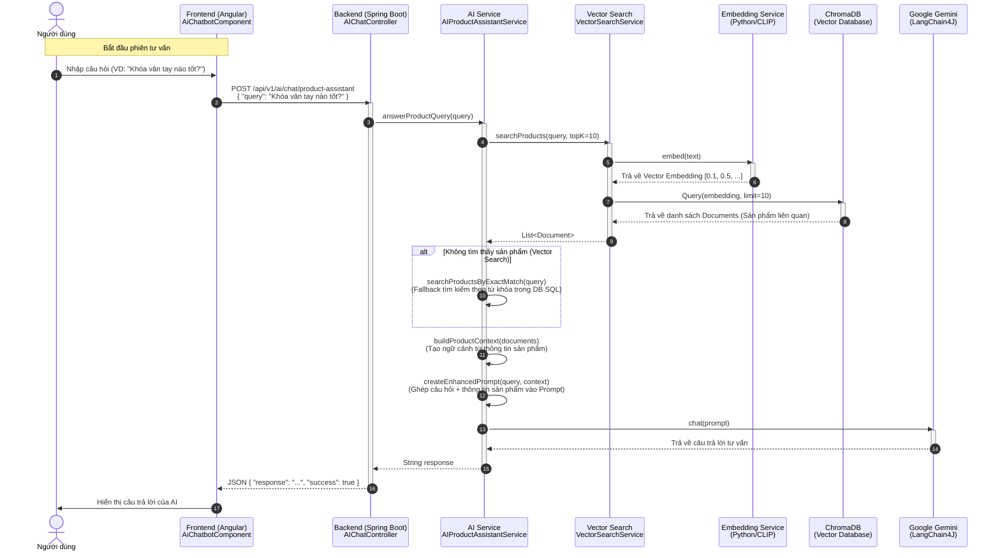

# Biểu đồ tuần tự: AI Tư vấn sản phẩm (Product Assistant)

## Sequence Diagram (Mermaid)

## Giải thích chi tiết

1.  **User Interaction**: Người dùng nhập câu hỏi vào khung chat trên giao diện Angular (`AiChatbotComponent`).
2.  **API Call**: Frontend gọi API `/product-assistant` đến Backend Spring Boot.
3.  **Vector Search**:
    *   Backend yêu cầu `VectorSearchService` tìm kiếm sản phẩm liên quan.
    *   `VectorSearchService` gọi sang **Python Service** (chạy model CLIP) để chuyển câu hỏi văn bản thành vector (embedding).
    *   Sử dụng vector này để truy vấn **ChromaDB** nhằm tìm ra các sản phẩm có đặc điểm tương đồng nhất về mặt ngữ nghĩa.
4.  **Context Building**:
    *   Nếu tìm thấy sản phẩm, hệ thống sẽ trích xuất thông tin (Tên, Giá, Mô tả, Tính năng...) để tạo thành một đoạn văn bản ngữ cảnh (Context).
    *   Nếu không tìm thấy qua Vector Search, hệ thống có cơ chế dự phòng (Fallback) tìm kiếm chính xác theo từ khóa trong Database SQL.
5.  **LLM Generation**:
    *   Backend gửi một Prompt bao gồm: "Vai trò chuyên gia tư vấn" + "Thông tin sản phẩm tìm được" + "Câu hỏi của người dùng" đến **Google Gemini**.
    *   Gemini phân tích và sinh ra câu trả lời dựa trên thông tin sản phẩm thực tế được cung cấp.
6.  **Response**: Câu trả lời được trả về Frontend và hiển thị cho người dùng.
