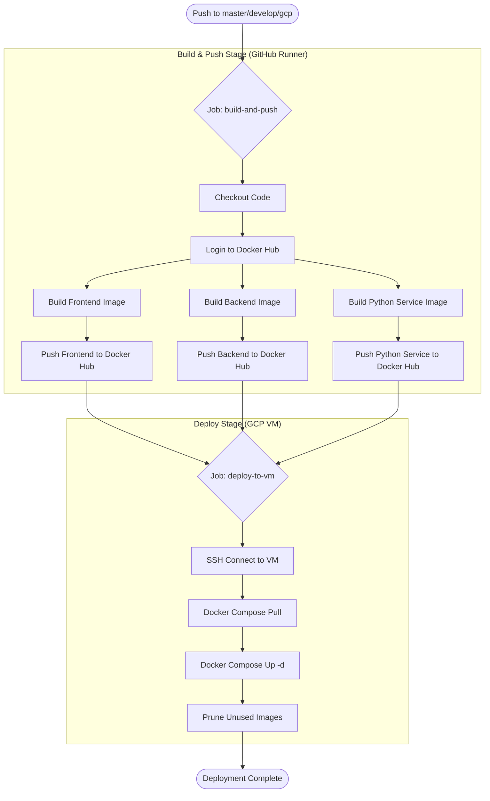

# Quy trình CI/CD (GitHub Actions)

## Flowchart (Mermaid)

## Giải thích chi tiết

Quy trình CI/CD được tự động hóa bằng GitHub Actions, bao gồm 2 giai đoạn chính:

### 1. Giai đoạn Build & Push (Xây dựng và Đẩy ảnh)
*   **Trigger**: Kích hoạt khi có code mới được push lên các nhánh `master`, `develop`, hoặc `gcp`.
*   **Môi trường**: Chạy trên GitHub Hosted Runner (Ubuntu Latest).
*   **Các bước**:
    1.  **Checkout**: Lấy mã nguồn mới nhất từ repository.
    2.  **Login Docker Hub**: Đăng nhập vào Docker Hub sử dụng secrets.
    3.  **Build & Push Frontend**:
        *   Sử dụng `DockerfileAngular`.
        *   Tạo image `lockerkorea-frontend:latest`.
        *   Đẩy lên Docker Hub.
    4.  **Build & Push Backend**:
        *   Sử dụng `DockerfileJavaSpring`.
        *   Tạo image `lockerkorea-backend:latest`.
        *   Đẩy lên Docker Hub.
    5.  **Build & Push Python Service**:
        *   Sử dụng `DockerfilePython`.
        *   Tạo image `lockerkorea-python:latest`.
        *   Đẩy lên Docker Hub.

### 2. Giai đoạn Deploy (Triển khai)
*   **Điều kiện**: Chỉ chạy sau khi giai đoạn Build & Push thành công.
*   **Môi trường**: Kết nối SSH vào Google Cloud Platform (GCP) VM.
*   **Các bước**:
    1.  **SSH Connection**: Kết nối an toàn vào server bằng SSH Key.
    2.  **Pull Images**: Chạy lệnh `docker compose pull` để tải các image mới nhất vừa được build từ Docker Hub về server.
    3.  **Restart Containers**: Chạy lệnh `docker compose up -d` để khởi động lại các container với code mới.
    4.  **Cleanup**: Chạy `docker image prune -f` để xóa các image cũ không còn sử dụng, giải phóng dung lượng đĩa.
