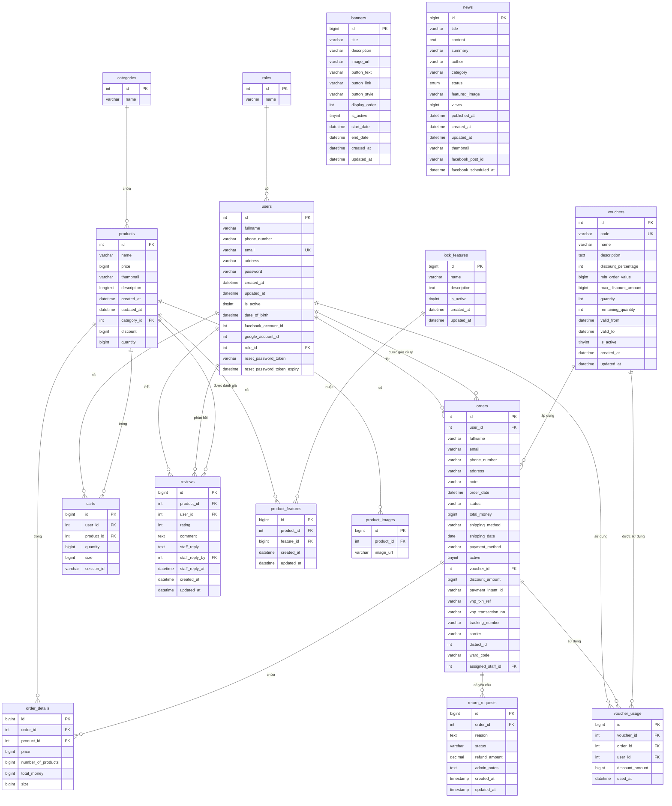

# LockerKorea - Thiết kế Cơ sở Dữ liệu

## Sơ đồ ER (Entity Relationship Diagram)

## Mô tả các bảng chính

### 1. Quản lý Người dùng
- **roles**: Vai trò người dùng (USER, ADMIN, STAFF)
- **users**: Thông tin người dùng, hỗ trợ đăng nhập Facebook/Google

### 2. Quản lý Sản phẩm
- **categories**: Danh mục sản phẩm (GATEMAN, SAMSUNG, H-Gang, EPIC, WELKOM, etc.)
- **products**: Thông tin sản phẩm khóa điện tử
- **lock_features**: Tính năng của khóa (vân tay, PIN, thẻ từ, Bluetooth, WiFi, etc.)
- **product_features**: Liên kết sản phẩm với tính năng (Many-to-Many)
- **product_images**: Hình ảnh sản phẩm

### 3. Quản lý Đơn hàng
- **orders**: Đơn hàng với trạng thái (processing, shipped, delivered, cancelled, payment_failed)
- **order_details**: Chi tiết từng sản phẩm trong đơn hàng
- **return_requests**: Yêu cầu trả hàng/hoàn tiền

### 4. Quản lý Giỏ hàng
- **carts**: Giỏ hàng (hỗ trợ cả user đăng nhập và session)

### 5. Quản lý Voucher
- **vouchers**: Mã giảm giá với điều kiện sử dụng
- **voucher_usage**: Lịch sử sử dụng voucher

### 6. Quản lý Đánh giá
- **reviews**: Đánh giá sản phẩm từ khách hàng, có thể có phản hồi từ nhân viên

### 7. Quản lý Nội dung
- **banners**: Banner trang chủ
- **news**: Tin tức, bài viết

## Các mối quan hệ chính

1. **Users ↔ Roles**: Một người dùng có một vai trò
2. **Products ↔ Categories**: Một sản phẩm thuộc một danh mục
3. **Products ↔ Features**: Nhiều-nhiều (qua bảng product_features)
4. **Orders ↔ Users**: Một người dùng có nhiều đơn hàng
5. **Orders ↔ Products**: Nhiều-nhiều (qua bảng order_details)
6. **Orders ↔ Vouchers**: Một đơn hàng có thể sử dụng một voucher
7. **Reviews**: Liên kết Products và Users, có thể có phản hồi từ Staff

## Tính năng đặc biệt

- **Thanh toán**: Hỗ trợ VNPAY và Stripe (payment_intent_id, vnp_txn_ref)
- **Vận chuyển**: Tracking number và carrier (GHN)
- **Phân quyền**: 3 vai trò (USER, ADMIN, STAFF)
- **Đăng nhập xã hội**: Facebook và Google (facebook_account_id, google_account_id)
- **Quản lý đơn hàng**: Gán nhân viên xử lý (assigned_staff_id)
- **Tích hợp Facebook**: Đăng bài tin tức lên Facebook (facebook_post_id)

