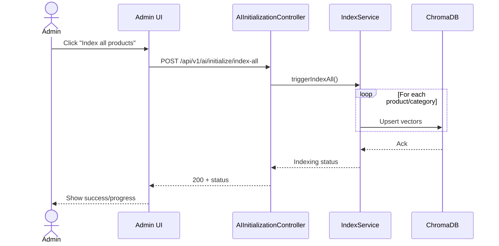
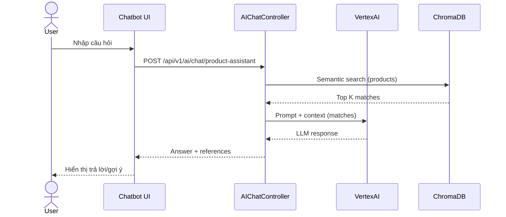
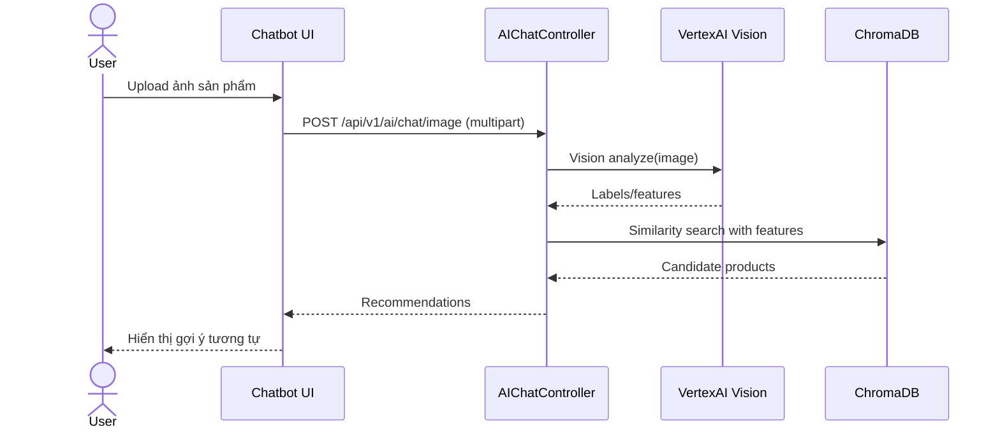
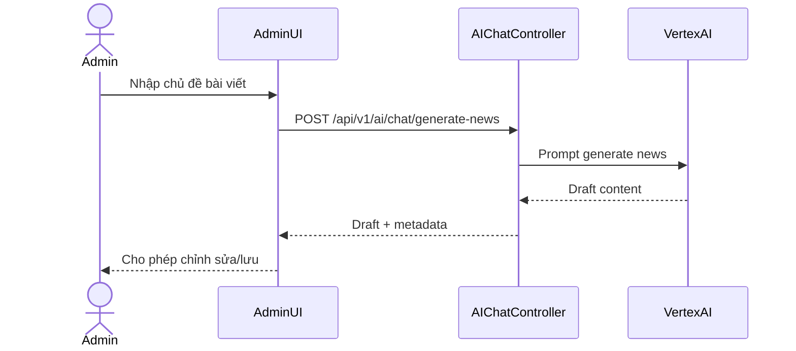
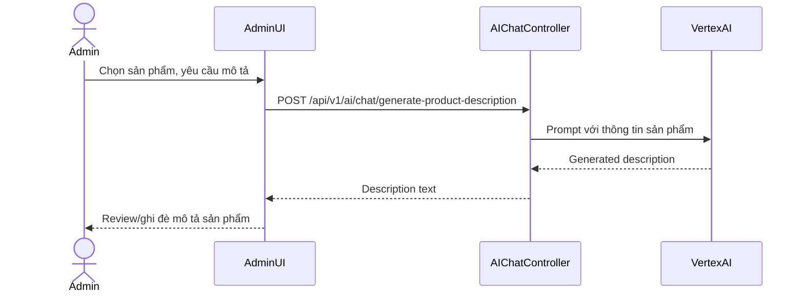
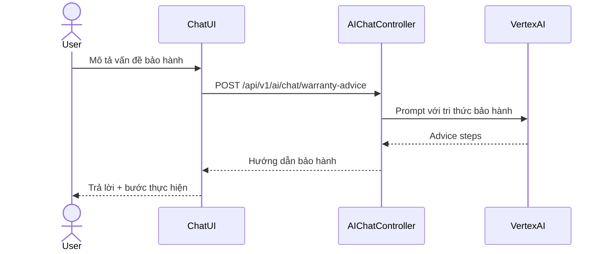
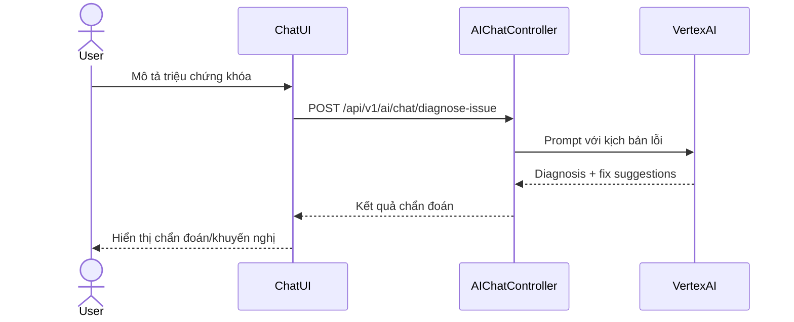
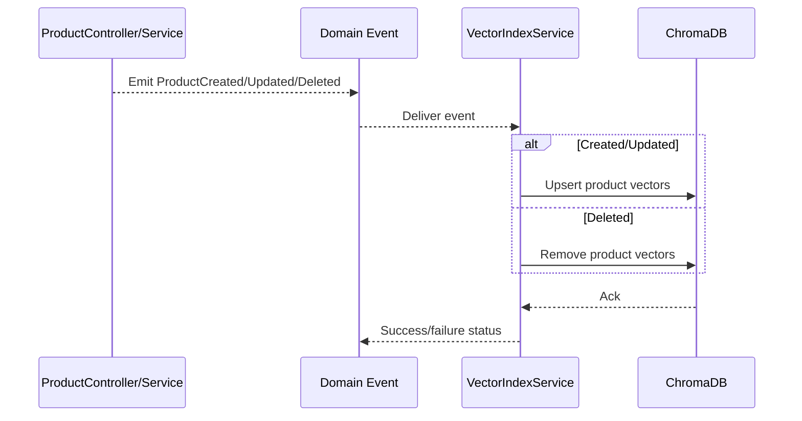

## Sequence diagrams — Use Cases 26–33

### 26) Tích hợp AI cho nội dung & chỉ mục

### 27) AI tư vấn sản phẩm / tìm kiếm ngữ nghĩa / khuyến nghị

### 28) Phân tích hình ảnh sản phẩm

### 29) Sinh nội dung Tin tức bằng AI

### 30) Sinh mô tả sản phẩm bằng AI

### 31) Tư vấn Bảo hành bằng AI

### 32) Chẩn đoán lỗi khóa bằng AI

### 33) Tự động chỉ mục dữ liệu khi CRUD sản phẩm (listener)

