# 📊 Use Case Diagram - Locker Korea

## Biểu đồ Use Case tổng quan

```mermaid
flowchart TB
    subgraph Actors
        Guest([Guest Visitor])
        Customer([Customer ROLE_USER])
        Staff([Staff Support])
        Admin([Admin ROLE_ADMIN])
        AI([AI Services])
    end

    subgraph PublicSite [Public Experience]
        UC_Browse[(Browse Catalog & Product Detail)]
        UC_Banner[(View Home Banners)]
        UC_News[(Read News)]
        UC_Register[(Register Login Reset Password)]
        UC_AI_Public[(AI Product Chatbot)]
    end

    subgraph CustomerZone [Customer Self-Service]
        UC_Cart[(Manage Cart)]
        UC_Voucher[(Apply Voucher)]
        UC_Order[(Checkout & Payments)]
        UC_History[(Order History)]
        UC_Return[(Return Requests)]
        UC_Review[(Product Reviews)]
        UC_Profile[(Profile & Password)]
        UC_Chat[(Chat with Staff)]
    end

    subgraph StaffWorkspace [Staff Workspace]
        UC_StaffChat[(Handle Customer Chats)]
    end

    subgraph AdminConsole [Admin Console]
        UC_ProductAdmin[(Manage Products & Features)]
        UC_CategoryAdmin[(Manage Categories)]
        UC_UserAdmin[(Manage Users & Roles)]
        UC_OrderAdmin[(Admin Order Ops)]
        UC_ReviewAdmin[(Moderate Reviews)]
        UC_VoucherAdmin[(Manage Vouchers)]
        UC_BannerAdmin[(Manage Banners)]
        UC_NewsAdmin[(Manage News)]
        UC_ReturnAdmin[(Manage Return Requests)]
        UC_Stats[(Dashboard & Analytics)]
        UC_AI_Index[(AI Index Management)]
    end

    subgraph AIServices [AI & Automation]
        UC_AI_Assist[(AI Assistance & Recommendations)]
        UC_AI_Content[(Generate Content)]
        UC_AI_Warranty[(Warranty Advice & Diagnostics)]
        UC_AI_IndexBg[(Auto Index Updates)]
    end

    Guest --> UC_Browse
    Guest --> UC_Banner
    Guest --> UC_News
    Guest --> UC_Register
    Guest --> UC_AI_Public

    Customer --> UC_Browse
    Customer --> UC_News
    Customer --> UC_Cart
    Customer --> UC_Voucher
    Customer --> UC_Order
    Customer --> UC_History
    Customer --> UC_Return
    Customer --> UC_Review
    Customer --> UC_Profile
    Customer --> UC_Chat
    Customer --> UC_AI_Public

    Staff --> UC_StaffChat

    Admin --> UC_ProductAdmin
    Admin --> UC_CategoryAdmin
    Admin --> UC_UserAdmin
    Admin --> UC_OrderAdmin
    Admin --> UC_ReviewAdmin
    Admin --> UC_VoucherAdmin
    Admin --> UC_BannerAdmin
    Admin --> UC_NewsAdmin
    Admin --> UC_ReturnAdmin
    Admin --> UC_Stats
    Admin --> UC_AI_Index

    AI --> UC_AI_Assist
    AI --> UC_AI_Content
    AI --> UC_AI_Warranty
    AI --> UC_AI_IndexBg

    UC_AI_IndexBg --> UC_ProductAdmin
    UC_AI_IndexBg --> UC_AI_Index
    UC_AI_Assist --> UC_AI_Public
    UC_AI_Assist --> UC_Chat
    UC_AI_Content --> UC_NewsAdmin
    UC_AI_Warranty --> UC_ReturnAdmin
```

## Đặc tả tổng quát các tính năng

### 1. Guest / Visitor (Khách chưa đăng nhập)

#### 1.1. Duyệt Home và Banner
- **Mục đích**: Xem banner quảng cáo, nhấn CTA để điều hướng đến danh mục/sản phẩm
- **UI Routes**: `/Home`
- **Backend APIs**: 
  - `GET /api/v1/banners/active`
  - `GET /api/v1/banners`

#### 1.2. Duyệt Catalog và Chi tiết Sản phẩm
- **Mục đích**: Xem danh sách sản phẩm, lọc, tìm kiếm, xem chi tiết và ảnh sản phẩm
- **UI Routes**: 
  - `/allProduct` - Danh sách sản phẩm
  - `/detailProduct/:id` - Chi tiết sản phẩm
- **Backend APIs**:
  - `GET /api/v1/products` (paging/filter)
  - `GET /api/v1/products/{id}`
  - `GET /api/v1/products/search`
  - `GET /api/v1/products/price`
  - `GET /api/v1/products/category/{id}`

#### 1.3. Đọc Tin tức (News)
- **Mục đích**: Xem danh sách và chi tiết tin đã xuất bản, tìm kiếm, lọc theo danh mục
- **UI Routes**: `/news`, `/news/:id`
- **Backend APIs**:
  - `GET /api/v1/news/published` (list)
  - `GET /api/v1/news/published/{id}` (view + auto-increment view)
  - `GET /api/v1/news/published/search?keyword=...`
  - `GET /api/v1/news/published/category/{category}`

#### 1.4. Đăng ký / Đăng nhập / Quên mật khẩu
- **Mục đích**: Tạo tài khoản, đăng nhập, khôi phục mật khẩu
- **UI Routes**: `/auth-login`, `/register`, `/forgot-password`, `/reset-password`
- **Backend APIs**:
  - `POST /api/v1/users/register`
  - `POST /api/v1/users/login`
  - `POST /api/v1/users/forgot-password`
  - `POST /api/v1/users/reset-password`

#### 1.5. AI Chatbot Tư vấn Sản phẩm
- **Mục đích**: Hỏi đáp tư vấn khóa điện tử, tìm sản phẩm theo tính năng/giá, phân tích ảnh
- **UI**: Floating chatbot component
- **Backend APIs**:
  - `POST /api/v1/ai/chat/product-assistant`
  - `POST /api/v1/ai/chat/text`
  - `POST /api/v1/ai/chat/image`

---

### 2. Customer / User (Đã đăng nhập - ROLE_USER)

#### 2.1. Quản lý Giỏ hàng
- **Mục đích**: Thêm, sửa, xóa sản phẩm trong giỏ hàng
- **UI Routes**: `/shoppingCart`
- **Backend APIs**:
  - `POST /api/v1/carts` (add)
  - `GET /api/v1/carts`
  - `PUT /api/v1/carts/{id}`
  - `DELETE /api/v1/carts/{id}`
  - `DELETE /api/v1/carts` (clear all)

#### 2.2. Áp dụng Voucher
- **Mục đích**: Áp dụng mã giảm giá vào đơn hàng
- **UI**: Trong giỏ hàng/checkout, trang hiển thị voucher
- **Backend APIs**:
  - `GET /api/v1/vouchers/homepage`
  - `GET /api/v1/vouchers/code/{code}`
  - `POST /api/v1/vouchers/apply`

#### 2.3. Đặt hàng và Thanh toán
- **Mục đích**: Tạo đơn hàng, thanh toán qua Stripe hoặc VNPay
- **UI Routes**: `/order`, `/order-detail/:id`
- **Backend APIs**:
  - `POST /api/v1/orders` (create)
  - `GET /api/v1/orders/user`
  - `GET /api/v1/orders/{id}`
  - `PUT /api/v1/orders/{id}`
- **Payment APIs**:
  - **Stripe**: 
    - `POST /api/v1/payments/stripe/create-payment-intent`
    - `POST /api/v1/payments/stripe/confirm-payment/{id}`
  - **VNPay**:
    - `POST /api/v1/payments/vnpay/create-payment`
    - `POST /api/v1/payments/vnpay/refund`
    - `GET /api/v1/payments/vnpay/payment-callback`

#### 2.4. Xem Lịch sử và Chi tiết Đơn hàng
- **Mục đích**: Xem danh sách đơn hàng đã đặt và chi tiết từng đơn
- **UI Routes**: `/history`, `/order-detail/:id`
- **Backend APIs**:
  - `GET /api/v1/orders/user`
  - `GET /api/v1/orders/{id}`

#### 2.5. Yêu cầu Đổi/Trả (Return Request)
- **Mục đích**: Tạo và theo dõi yêu cầu đổi/trả hàng
- **UI Routes**: `/return-request/:orderId`, `/my-returns`
- **Backend APIs**:
  - `POST /api/v1/returns` (create)
  - `GET /api/v1/returns/my-requests`

#### 2.6. Đánh giá Sản phẩm (Reviews)
- **Mục đích**: Đánh giá, bình luận về sản phẩm đã mua
- **UI**: Trong trang chi tiết sản phẩm
- **Backend APIs**:
  - `POST /api/v1/reviews` (create)
  - `PUT /api/v1/reviews/{id}`
  - `DELETE /api/v1/reviews/{id}`
  - `GET /api/v1/reviews/product/{productId}`

#### 2.7. Hồ sơ Người dùng và Bảo mật
- **Mục đích**: Quản lý thông tin cá nhân, đổi mật khẩu
- **UI Routes**: `/user-profile`, `/change-password`
- **Backend APIs**:
  - `GET /api/v1/users/details`
  - `PUT /api/v1/users/details/{userId}`
  - `POST /api/v1/users/change-password`

#### 2.8. Chat với Nhân viên Hỗ trợ
- **Mục đích**: Giao tiếp trực tiếp với nhân viên hỗ trợ
- **UI**: Customer chat component
- **Backend APIs**:
  - `POST /api/v1/chat/send`
  - `GET /api/v1/chat/conversation/{otherUserId}`
  - `GET /api/v1/chat/messages`
  - `GET /api/v1/chat/unread`
  - `POST /api/v1/chat/send-file` (multipart)

---

### 3. Staff / Support

#### 3.1. Quản lý Hội thoại Khách hàng
- **Mục đích**: Xem danh sách khách hàng, trả lời tin nhắn, quản lý cuộc trò chuyện
- **UI Routes**: `/staff/chat` (StaffGuard)
- **Backend APIs**:
  - `GET /api/v1/chat/staff/customers`
  - `PUT /api/v1/chat/read/{messageId}`
  - `PUT /api/v1/chat/read-all`
  - `PUT /api/v1/chat/close/{customerId}`

---

### 4. Admin (ROLE_ADMIN)

#### 4.1. Quản lý Sản phẩm (CRUD + Ảnh)
- **Mục đích**: Tạo, sửa, xóa sản phẩm, upload ảnh
- **UI Routes**: `/productManage`, `/uploadProduct`
- **Backend APIs**:
  - `POST /api/v1/products` (create)
  - `POST /api/v1/products/uploads/{id}` (multipart)
  - `GET /api/v1/products`, `/all`, `/by-ids`
  - `PUT /api/v1/products/{id}`
  - `DELETE /api/v1/products/{id}`
  - `DELETE /api/v1/products/images/{id}`

#### 4.2. Quản lý Danh mục (Category)
- **Mục đích**: CRUD danh mục sản phẩm
- **UI Routes**: `/categoryManage`
- **Backend APIs**:
  - `POST /api/v1/categories`
  - `GET /api/v1/categories`
  - `PUT /api/v1/categories/{id}`
  - `DELETE /api/v1/categories/{id}`

#### 4.3. Quản lý Tính năng Khóa (Lock Features)
- **Mục đích**: Quản lý tính năng khóa và gán vào sản phẩm
- **UI Routes**: `/featureManage`
- **Backend APIs**:
  - `GET /api/v1/lock-features`, `/active`
  - `POST /api/v1/lock-features`
  - `PUT /api/v1/lock-features/{id}`
  - `DELETE /api/v1/lock-features/{id}`
  - `POST /api/v1/product-features/product/{productId}`
  - `GET /api/v1/product-features/product/{productId}`
  - `DELETE /api/v1/product-features/product/{productId}/feature/{featureId}`

#### 4.4. Quản lý Người dùng & Phân quyền
- **Mục đích**: Quản lý tài khoản người dùng, thay đổi quyền
- **UI Routes**: `/userManage`
- **Backend APIs**:
  - `GET /api/v1/users/getAll`
  - `GET /api/v1/users/find`
  - `PUT /api/v1/users/change-active/{userId}`
  - `PUT /api/v1/users/changeRole/{userId}`
  - `DELETE /api/v1/users/delete/{id}`
  - `GET /api/v1/roles`

#### 4.5. Quản lý Đơn hàng
- **Mục đích**: Xem danh sách đơn hàng, cập nhật trạng thái, xóa đơn
- **UI Routes**: `/orderManage`
- **Backend APIs**:
  - `GET /api/v1/orders/admin`
  - `PUT /api/v1/orders/status/{id}`
  - `DELETE /api/v1/orders/{id}`

#### 4.6. Quản lý Đánh giá (Reviews)
- **Mục đích**: Xem, xóa, chỉnh sửa đánh giá của khách hàng
- **UI Routes**: `/reviewManage`
- **Backend APIs**:
  - `GET /api/v1/reviews/admin/all`
  - `DELETE /api/v1/reviews/{id}`
  - `PUT /api/v1/reviews/{id}`

#### 4.7. Quản lý Voucher
- **Mục đích**: Tạo, sửa, xóa mã giảm giá
- **UI Routes**: `/voucherManage`
- **Backend APIs**:
  - `POST /api/v1/vouchers`
  - `GET /api/v1/vouchers`, `/homepage`, `/search`
  - `PUT /api/v1/vouchers/{id}`
  - `DELETE /api/v1/vouchers/{id}`

#### 4.8. Quản lý Banner trang chủ
- **Mục đích**: Tạo, sửa, xóa banner quảng cáo
- **UI Routes**: `/bannerManage`
- **Backend APIs**:
  - `GET /api/v1/banners`, `/active`
  - `POST /api/v1/banners`
  - `POST /api/v1/banners/upload` (multipart)
  - `PUT /api/v1/banners/{id}`
  - `DELETE /api/v1/banners/{id}`
  - `GET /api/v1/banners/images/{imageName}`

#### 4.9. Quản lý Tin tức (News)
- **Mục đích**: Tạo, sửa, xuất bản, xóa tin tức
- **UI Routes**: `/newsManage`
- **Backend APIs**:
  - `GET /api/v1/news/admin/all`
  - `GET /api/v1/news/admin/{id}`
  - `POST /api/v1/news/admin`
  - `PUT /api/v1/news/admin/{id}`
  - `PUT /api/v1/news/admin/{id}/publish`
  - `PUT /api/v1/news/admin/{id}/archive`
  - `DELETE /api/v1/news/admin/{id}`

#### 4.10. Quản lý Yêu cầu Đổi/Trả
- **Mục đích**: Xem, duyệt, từ chối yêu cầu đổi/trả
- **UI Routes**: `/admin/returns`
- **Backend APIs**:
  - `GET /api/v1/returns/admin/all`
  - `PUT /api/v1/returns/admin/{id}/approve`
  - `PUT /api/v1/returns/admin/{id}/reject`
  - `PUT /api/v1/returns/admin/{id}/complete-refund`

#### 4.11. Thống kê & Dashboard
- **Mục đích**: Xem báo cáo doanh thu, sản phẩm bán chạy, thống kê đơn hàng
- **UI**: Statistics components
- **Backend APIs**:
  - `GET /api/v1/statistics/daily-revenue/{date}`
  - `GET /api/v1/statistics/revenue-by-*`
  - `GET /api/v1/statistics/product-*`
  - `GET /api/v1/statistics/today-overview`
  - `GET /api/v1/statistics/orders-today`
  - `GET /api/v1/statistics/top-*`

#### 4.12. Tích hợp AI cho Nội dung & Chỉ mục
- **Mục đích**: Khởi tạo/chỉ mục dữ liệu sản phẩm cho vector search
- **Backend APIs**:
  - `POST /api/v1/ai/initialize/index-all`
  - `GET /api/v1/ai/initialize/status`
  - `DELETE /api/v1/ai/initialize/clear-index`
  - `GET /api/v1/ai/search/products*`
  - `POST /api/v1/ai/search/index/all-products`
  - `POST /api/v1/ai/search/index/all-categories`

---

### 5. System / AI Use Cases

#### 5.1. AI Tư vấn Sản phẩm, Tìm kiếm Ngữ nghĩa
- **Mục đích**: Tư vấn sản phẩm thông minh, tìm kiếm semantic, khuyến nghị
- **Backend APIs**:
  - `POST /api/v1/ai/chat/product-assistant`
  - `POST /api/v1/ai/chat/product-assistant/by-category`
  - `POST /api/v1/ai/chat/product-assistant/compare`
  - `POST /api/v1/ai/chat/product-assistant/recommend`
  - `GET /api/v1/ai/search/products*`

#### 5.2. Phân tích Hình ảnh Sản phẩm
- **Mục đích**: Upload ảnh để tìm sản phẩm tương tự
- **Backend APIs**:
  - `POST /api/v1/ai/chat/image` (multipart)

#### 5.3. Sinh Nội dung Tin tức bằng AI
- **Mục đích**: Tự động tạo bài viết tin tức
- **Backend APIs**:
  - `POST /api/v1/ai/chat/generate-news`

#### 5.4. Sinh Mô tả Sản phẩm bằng AI
- **Mục đích**: Tự động tạo mô tả sản phẩm
- **Backend APIs**:
  - `POST /api/v1/ai/chat/generate-product-description`

#### 5.5. Tư vấn Bảo hành bằng AI
- **Mục đích**: Tư vấn về chính sách bảo hành
- **Backend APIs**:
  - `POST /api/v1/ai/chat/warranty-advice`

#### 5.6. Chẩn đoán Lỗi Khóa bằng AI
- **Mục đích**: Phân tích và chẩn đoán lỗi khóa từ mô tả của khách hàng
- **Backend APIs**:
  - `POST /api/v1/ai/chat/diagnose-issue`

#### 5.7. Tự động Chỉ mục Dữ liệu
- **Mục đích**: Tự động cập nhật vector index khi CRUD sản phẩm
- **Cơ chế**: Product events → cập nhật ChromaDB

---

## Tổng kết

Hệ thống **Locker Korea** bao gồm:

- **5 nhóm Actor**: Guest, Customer, Staff, Admin, AI System
- **33+ Use Cases** chính được phân loại theo từng nhóm actor
- **Công nghệ**: Angular 17 (SSR), Spring Boot 3, MySQL, Stripe & VNPay, Google Vertex AI + ChromaDB
- **Tính năng nổi bật**: AI Chatbot tư vấn, Vector Search, Thanh toán đa phương thức, Chat hỗ trợ real-time

