# Sơ đồ Hoạt động (Ngang) - AI Chatbot

Phiên bản này loại bỏ khung bao quanh để sơ đồ gọn gàng hơn, sử dụng màu sắc để phân biệt các thành phần:
*   **Màu Trắng/Xám:** Client/User
*   **Màu Xanh Dương:** Java Backend
*   **Màu Xanh Lá:** Python AI Service
*   **Màu Cam:** Điểm rẽ nhánh (Decision)

```mermaid
flowchart LR
    %% Nodes
    Start((Start))
    UserReq[Gửi Ảnh + Câu hỏi]:::client
    Display[Hiển thị kết quả]:::client
    End((End))

    %% Java Nodes
    Receive[Nhận Request]:::java
    Upload[Upload Ảnh Cloud]:::java
    Bridge[Gọi Python Service]:::java
    ResJava[Trả Response]:::java

    %% Python Nodes
    Download[Tải Ảnh]:::python
    Embed[Tạo Vector]:::python
    Search[Tìm trong DB]:::python
    Decision{Có thấy SP?}:::decision
    
    FoundPath[Lấy Info SP]:::python
    NotFoundPath[Dùng Info Ảnh]:::python
    
    Prompt[Tạo Prompt]:::python
    LLM[Gọi AI Gemini]:::python

    %% Flow
    Start --> UserReq
    UserReq --> Receive
    Receive --> Upload
    Upload --> Bridge
    Bridge --> Download
    
    Download --> Embed
    Embed --> Search
    Search --> Decision
    
    Decision -- Có --> FoundPath
    Decision -- Không --> NotFoundPath
    
    FoundPath --> Prompt
    NotFoundPath --> Prompt
    
    Prompt --> LLM
    LLM --> ResJava
    ResJava --> Display
    Display --> End

    %% Styling classes
    classDef client fill:#f9f9f9,stroke:#333,stroke-width:1px;
    classDef java fill:#e3f2fd,stroke:#1565c0,stroke-width:2px;
    classDef python fill:#e8f5e9,stroke:#2e7d32,stroke-width:2px;
    classDef decision fill:#ffcc80,stroke:#e65100,stroke-width:2px,shape:diamond;
```

